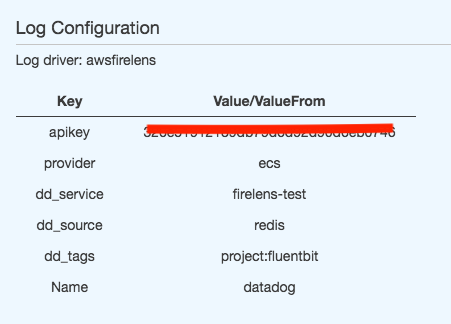

# AEM Number conversion Microservice

## Project Requirement

write a production ready microservice that converts given integer value to Roman number , including devops capabilities and make the 
product ready for prod

1. Support a range of numbers from 1 to 3999 
2. Include Devops capabilities 

## Roman Numeral  Reference

Wiki : https://en.wikipedia.org/wiki/Roman_numerals

## System  Architecture
Following is my current system architecture for building Highy Available  and Scalable system by leveraging different public cloud service offerings   
 ( Infrastructure as a Service  - IAAS  and Software as Service - SAAS ) 


## Service  Architecture
Spring boot is used to develop the complete  micro service system, following is the high
level micro service acrchitecture of the services in the system.


## Deliverable - <a href="http://aem-application-lb-664989903.us-west-2.elb.amazonaws.com/aem/api/v1/convert?number=12" target="_blank">API ( Click Here )</a>


With the above architectural components in place, shared above is a production-ready API Hosted on elastic container service having a scaling group for scalability and exposed along with a load balancer for high availability.
#### Input   

* number 
* conversionType ( Optional )

Note:
The reason for introducing the second parameter, though it is not an ask in the project requirement is for the extensibility of the service, with the second parameter,  we get the flexibility to tell which number system we want to convert,  today we defaulted to ROMAN, but if we need to convert to any other number system, we don't need to change the API end point, the current API is open for an extension to adopt to any number system conversion, with the same reason I haven't included the word roman numeral in the endpoint URL.


#### Output  
API will return the following fields , We  can update the model as per our business requirement.

* OUTPUT
* INPUT
* ERRORCODE
* ERRORMESSAGE
* SUCCESS

<br>
Sample endpoint looks as follows, where conversion type is completely optional and defaulted to ROMAN.

<br>

```
curl -X GET "http://localhost:8080/aem/api/v1/convert?conversionType=ROMAN&number=1" -H "accept: */*"

```

<a href="http://aem-application-lb-664989903.us-west-2.elb.amazonaws.com/aem/swagger-ui.html#/number-controller">Swagger ( Click Here )</a>

### Different  Use cases 

#### 1. Valid  Number 


#### 2. Max  Number

#### 3. Min  Number

#### 4. Empty  Number

#### 4. Different number system


## Dive into System Components 

## Health Monitoring Dashboard  ( Datadog , AWS )
<br>
<a href="https://p.datadoghq.com/sb/678ebe76-fb32-11eb-bb9e-da7ad0900002-bf1d0c86380c08372743e17c42d96c74?from_ts=1629185894725&to_ts=1629189494725&live=true" target="_blank">Adobe AEM Service Live Dash Board  - ( Click Here )</a>


Datadog is a monitoring service for cloud-scale applications, providing monitoring of servers, databases, tools, and services, through a SaaS-based data analytics platform.
Attached above is the configured dashboard on data dog with public cloud service offerings.

How it Works ?

Datadog provides real time integrations with different cloud services, with our current requirement
I had leveraged AWS services. It does API polling with the AWS integration using configured roles  and does a metric-by-metric crawl of the CloudWatch API to pull data to send to Datadog.
We can achieve this  with different configurations, either we can use a cloud formation template which provides
infrastructure as a code or you can use role based communication between data dog and aws.

## Configuartion
We need configuraitons to be done both on Datadog and AWS.

#### Datadog configurations:
Install respective plugins for all the required  resource monitoring , currently I have installed the plugins for elastic container service and load balancer to collect system metrics and request response metrics which you can see in the dashboard above , following that we need to create a role with required permissions in aws and configure the same in datadog as follows


#### AWS configuration:

Configure respective policies in aws which has integrations with datadog and attach the same to the 
role 


I had expereince working different other monitoring tools , please find some of my blogs in the
same context 

* <a href="https://ravishajava.com/2018/08/08/elasticsearch-datasource-grapahana/" target="_blank">Graphana and ElasticSearch </a>
* <a href="https://ravishajava.com/2020/03/16/code-coverage-configurations-for-maven-based-projects/" target="_blank">Prometheus and ElasticSearch</a>


## Log Ingesiton & Monitoring ( Fluentd , Datadog )

In today's cloud computing having containers and having  data growing exponentially and distributed we need centralized logging and a mechanism to ship the logs. In today's world there are different log shippers available in the cloud world like Filebeat, Logstash, Fluentd, etc. I had leveraged fluentd  here for ingesting the logs to Data dog which is our log monitoring  tool. fluent is configured as a side car and sits along with the container to ship the logs to the configured destination. With aws ecs we can configure the same along with the task definition, following is the configuration i made for shipping the logs from aws  ecs container.

Following is one of my blog post on centralized logging , which talks about different logs stacks like ELK
<br>https://ravishajava.com/2018/08/10/log-management-kubernetes/

## Configuartion
Following is the configuration where fluentd is sitting as a side car along with the service container to push the logs.
for this we need to have datadog api key to leverage their cloud SAAS offering, we do have different
offerings from datadog. we can also ship the same logs to splunk. 


Required configuration to push the logs to datadog, this configuration is done within the service container.



Once we have the above configurtion and the application is deployed , fluent but will start shipping the 
logs to the configured target. 

Following is the screenshot of the logs shipped to data dog dashboard. 


We can even capture the logs and share via email to the respective audience , here is the screenshot of the same. 


and the following is the screenshot of the email I received  for the same.


Apart from this , we also have search mechanisam for the logs which can be extenisively used 
by the developers  and operations.


## Elastic Container Service
Containers are the next level of virtual computing that came after virtual machines. Containers are easily deployable with different services like Docker, Rocket etc. Containers are the most frequently used packaging component in today cloud world,Therefore container orchestration is the most important task in today's container world and today we have different container orchestration frameworks like Kubernetes, Docker Swarm and many managed services like GKE, AKE, OKE and ECS. I had leveraged ECS from Amazon for container orchestration services by leveraging the autoscaling group and load balancers which provide high availability.

## Cluster Details
An Amazon ECS cluster is a logical grouping of tasks or services.The infrastructure capacity can be provided by AWS Fargate, which is serverless infrastructure that AWS manages, Amazon EC2 instances that you manage, or an on-premise server or virtual machine (VM) that you manage remotely.


## Service 
An Amazon ECS service allows us to run and maintain a specified number of instances of a task definition simultaneously in an Amazon ECS cluster. any required configuration for this, we will be doing here, just like Kubernetes deployment pod configuration, we will be doing such configuration here.

you can also auto scaling tab below, there where we can define the scaling policies for the 
containers. 


## Task 
The task definition is a text file (in JSON format) that describes one or more containers (up to a maximum of ten) that form your application. The task definition can be thought of as a blueprint for your application.


<br>
This is where we mention our docker image that nees to be deployed. 


## Scaling Configuration
Following are the scale-in and scale-out configurations defined based on CPU utilization.  if CPU utilization is less the containers get shrunk if it is more, the number of containers will be increased.

### Scale In 

### Scale out


## Load Balancer
Load balancer provides high availability to the system, so i had leveraged elastic load balancer
provided by AWS deployed across multiple Availability Zones. Load balancer in my current system
talks to ECS for providing the required services. One point to note here is, AWS Load balancer requires certain
health check point to be configured , i had leveraged spring actuator health endpoint for getting the health of the my system.

### Configuartion


### Health check with actuator


## Docker 
Building and publishing docker images to repositories is part of continuous integration. Therefore my maven build is capable of pushing and publishing  docker images of my Spring Boot application to the docker registry.


### Steps
1. Build a docker image of the Spring Boot application
2. Push the Docker image to dockerhub

My Docker Repo , where the docker image is published.


## Code Coverage 

Code coverage is a measurement of how many lines/blocks/arcs of your code are executed while the automated tests are running. I had leveraged jcoco for doing the same. we can add more tests to increase the code coverage, in the best interest of the time, i had added the required tests to demonstrate the code coverage well.

<Br>
We can add a coverage limit to the PR  and integrate it into CICD, if particular code coverage is not met we can stop the CICD pipeline, this requires some extra configuration.


## Testing

### Unit Testing
An improper unit testing product will definitely impact the product deliverable. Therefore Unit testing is an integral part of any agile development principles. Today we have different framework like junit
any many other frameworks, in the current system i had leveraged Junit.

### Mock Testing
This is an integral part of any unit testing , this helps in validating every layer in the application , whether it is Service Layer , DAO Layer or any workflow associated with the system, mocking helps us to mock all dependent object and helps in validating the system in place , i had leveraged mockito for the same.  These tests can pretty much help us in increasing code coverage and improve test performance as well.

### API  Testing

Rest Assured is a testing and specification framework for Rest based  applications , this framework helps in validating the API with simple  request and response specs.  I had leveraged spring boot test  and rest assured to add API automation  tests, this tests can be integrated to CICD  pipeline to validate  all the endpoints without even deploying the application  to the container, the tests i added for this microservice does the same, it brings in the application as a process and tries to hit the end point and validates the given use cases.

Benefits with Rest Assured 

* it is Extremely simple.  
* Facilitates the Given/When/Then syntax for your tests, where given is the inputs, when is execution and then is final validation of your results
* it helps in adding  reusable request response specs , these specs can be defined by QA. 
* Rest assured is  very handy when working with Rest end points. 

You can find some basic information here on rest assured testing.
<Br>

https://medium.com/bb-tutorials-and-thoughts/how-to-get-started-with-rest-assured-2c035d3c8467

## Run Application 
Running Application
Prerequisite : ( Java and Maven )
1) Make sure Java is installed in the system, min JDK 8 is required to run the application. https://docs.oracle.com/javase/8/docs/technotes/guides/install/mac_jdk.html#A1096855
2) The project deliverable I am sharing here is a Maven-based project, hence we need maven to be installed (How to install Maven on Windows, Linux, Mac) https://www.baeldung.com/install-maven-on-windows-linux-mac
3) once done with them both, you can run mvn clean installs, it will build the entire application along with running the respective tests.
4) To test locally you can run the application - AdobeAEMApplication
5) Once the application is started you can test with swagger, using the following endpoint.
4) For all DevOps capabilities please refer to the my read me above, where I leveraged different cloud services. 

## Possible Enhancements

Application can be extended with more capabilities by adding some of the following features.

* Load balancer can be configured with API Gateway to leverage more features  ( Eg prevent  DDOS attacks )
* Route  53 can be configured to API Gateway to leverage more DNS capabilities.
* Configuration management can be done using AWS cloudformation and AWS Service catalog.
* Lambda authorizers and Amazon Cognito user pools can be leveraged for rest authentication solutions.
* We can add more Test automation. 


## Conclusion
Finally to conclude, This is a wonderful exercise that gave me the opportunity to look and work on different cloud service offerings and look into the system in a more broad way. In Fact we can leverage many more features from AWS to enhance the system as per the requirements. Any corner you think of either its on analytics , Machine learning , IOT or any use case,  we can pretty much leverage  any  public cloud services and be ready into the market.


